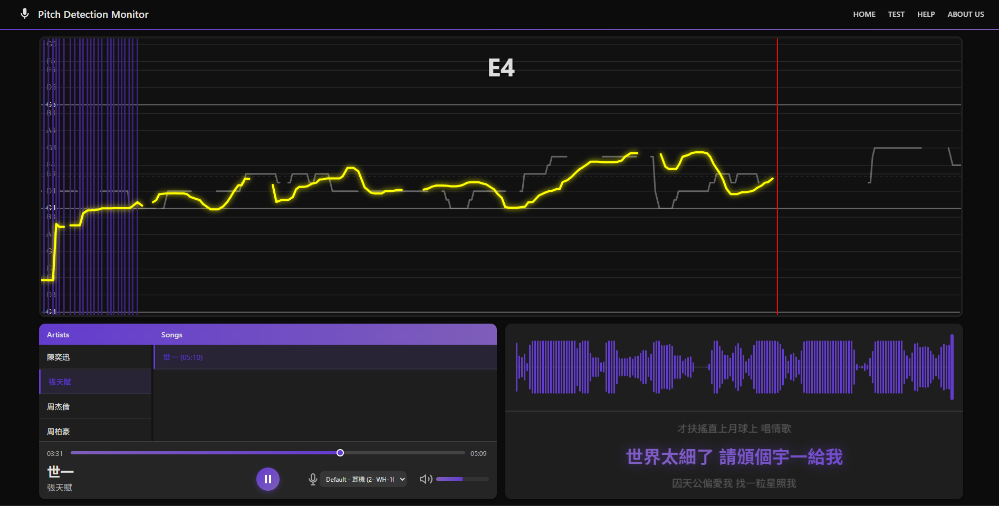
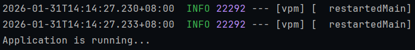

# Vocal Pitch Monitor Web Application
This project is dedicated for developing a web-based platform for real-time vocal pitch monitoring, using signal processing and machine learning to make professional vocal training more accessible through objective feedback and personalized coaching.

> Note that this project is incomplete. more modules to be added

## Usage Declaration
This application is developed strictly for educational and training purposes. Its primary goal is to
assist musicians and enthusiasts in practicing their vocal pitch skills through objective feedback and
analysis.

This application does not advocate, endorse, or facilitate the piracy of copyrighted songs.
Users are expected to utilize obtained audio files ONLY for their practice sessions.
## Web Application Architecture Diagram
* **Frontend Framework (Vue.js)** 
  1. **Lyrics Display:** Shows song lyrics line-by-line for singing along.
  2. **Song Selection:** Choose tracks from the database
  3. **Audio Player:** Plays music with essential playback controls and mic selection
  4. **Pitch Monitor:** Detects and displays live vocal pitch accuracy
  5. **Waveform Visualizer:** Visualizes audio as a moving graphical waveform.

* **Backend Framework (Spring Boot)** 
  1. **Controller**: Handle HTTP requests and responses with validation
  2. **Service**: Contains business logic implementation
  3. **DAO**: Interfaces for database operations

* **Database Schema (PostgreSQL)** 
1. Manages relational metadata, linking Artist and Song tables to audio, vocal, and lyric components via foreign key dependencies.
## Web Application UI

> Features real-time pitch detection with a dynamic frequency graph, pitch note overlays, and an audio waveform visualizer, alongside playback controls for selecting artists and songs

## Setup
- **Java Development Kit (JDK) version:** Java 21
- **Frameworks:** Spring boot v4.0.1 & Vue.js v3.5.24
- **Database:** PostgreSQL (Recommended) / MySQL

Before running the application, you must configure your database connection.

1. Navigate to ```src/main/resources/application.properties```.
2. Update the database credentials to match your local or cloud setup

Note: The project includes drivers for both, so you can choose your preferred database.

Datasource connection with PostgresSQL:
```
spring.datasource.url=jdbc:postgresql://localhost:5432/your_database_name
spring.datasource.username=your_username
spring.datasource.password=your_password
spring.datasource.driver-class-name=org.postgresql.Driver
```
Last, build and run the project on a IDE platform (VSCode / IntillJ IDEA).


If u see this message, the project is initiated on default port (http://localhost:8080).

After creating the database tables, configure this line to ```update``` in the ```application.properties```:
```
spring.jpa.hibernate.ddl-auto=update
```

If you have issues related to this project, capture the error and create a new issue in this GitHub repository


## Acknowledgement

This project is licensed under the MIT License. You are free to use, modify, and distribute this software. - see the [LICENSE](LICENSE) file for details.
