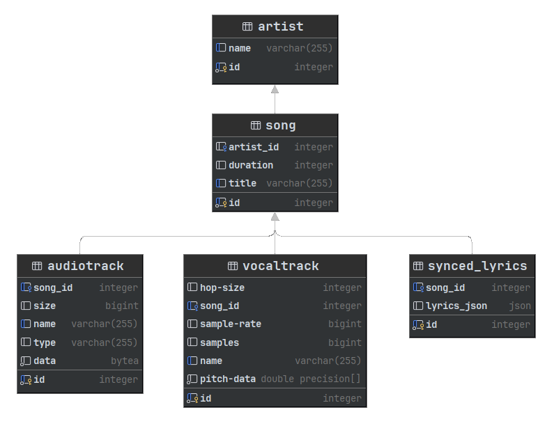

# Vocal Pitch Monitor Web Application
This project is dedicated for developing a web-based platform for real-time vocal pitch monitoring, using signal processing and machine learning to make professional vocal training more accessible through objective feedback and personalized coaching.

> Note that this project is incomplete. more modules to be added

## Usage Declaration:
This application is developed strictly for educational and training purposes. Its primary goal is to
assist musicians and enthusiasts in practicing their vocal pitch skills through objective feedback and
analysis.

This application does not advocate, endorse, or facilitate the piracy of copyrighted songs.
Users are expected to utilize legally obtained audio files for their practice sessions.

## Vocal Pitch Monitor UI:

>Features real-time pitch detection with a dynamic frequency graph, pitch note overlays, and an audio waveform visualizer, alongside playback controls for selecting artists and songs

## Database Structure (PostgresSQL):

> manages relational metadata, linking Artist and Song tables to audio, vocal, and lyric components via foreign key dependencies.

If you have issues related to this project, capture the error and create a new issue in this GitHub repository

